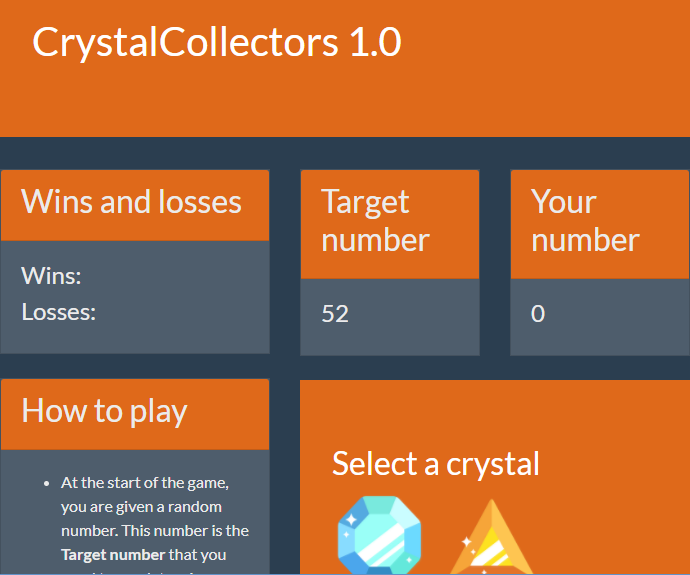

# Crystal Collectors Game

## Live
<a href="https://philipstubbs13.github.io/week-4-game/index.html" target="_blank">https://philipstubbs13.github.io/week-4-game/index.html</a>

## Screenshot

## Technologies used to create game

<li>HTML5</li>
<li>CSS</li>
<li>Bootstrap 4.0.0-beta</li>
<li>Javascript</li>
<li>JQuery</li>

## How to play
 	
<li>At the start of the game, you are given a random number. This number is the <b>Target number</b> that you need to reach to win.</li>
<li>To reach the <b>Target number</b>, click a crystal, which adds a specific number of points to <b>Your number</b>.</li>
<li>To win the game, <b>Your number</b> must match the <b>Target number</b>. If you go over the <b>Target number</b>,  you lose.</li>
<li>The value of each crystal is hidden from you until you click it.</li>
<li>Each time you start a new game, the game will change the values of each crystal and the value of the <b>Target number</b>. </li>

